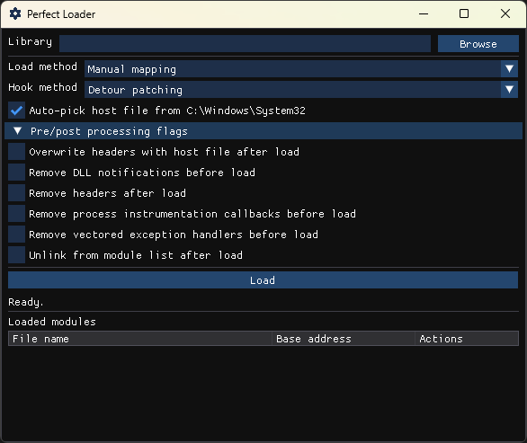

# Perfect Loader

[](LICENSE.txt)

A reference implementation of a perfect in-memory dynamic library loader for Windows.
The implementation may be considered perfect because it does not reimplement `LoadLibrary`, an approach that is inherently incomplete.
Rather, the implementation redirects `LoadLibrary` to use in-memory data, creating a solution that will always have feature parity with the native Windows loader.
More information is available in [the release blog for the project](https://gist.github.com/EvanMcBroom/0f45c1bdb55b4d5f43c7bcf336e0663e).




This project implements three solutions for redirecting `LoadLibrary`.
The first is based off of [A-Normal-User's](https://github.com/A-Normal-User) [work](https://github.com/A-Normal-User/MemoryDll-DllRedirect) of redirecting `LoadLibrary` by placing hooks on `NtOpenFile` and `NtMapViewOfSection`.
This project only requires a hook on `NtMapViewOfSection` for most Windows releases, but does require additional hooks to handle [changes made in Windows 11 24H2](https://github.com/EvanMcBroom/perfect-loader/issues/1#issuecomment-2578384262).

The second solution uses a similar method to [Process Doppelgänging](https://www.blackhat.com/docs/eu-17/materials/eu-17-Liberman-Lost-In-Transaction-Process-Doppelganging.pdf) of updating an opened file in a transaction and using it to create a section object.
The solution differs from [Tal Liberman](https://twitter.com/Tal_Liberman) and [Eugene Kogan](https://twitter.com/eukogan)'s work by redirecting `LoadLibrary` to use the section instead of using the section to create a new process or thread.
To my knowledge, this is a novel approach to using transactions and I personally refer to it as Module Doppelgänging to acknowledge Tal and Eugene's prior work.

The third solution uses a similar method to CheckPointSW's [VectoredOverloading code](https://github.com/CheckPointSW/VectoredOverloading).
The solution differs by hooking `NtCreateSection` to modify its input parameters and `NtMapViewOfSection` to hollow the mapped view of the section.
This approach is called module or section hollowing and it is not affected by the Windows 11 24H2 loader changes that affect approach one.
[Alex Short](https://twitter.com/alexsho71327477) 
[has a similar POC](https://github.com/rbmm/ARL/tree/bbe7888122ee556019026c6c6c8359cd16412368) that is worth referencing.
Another example may be found in the [loader routines for the ZeroAccess toolkit](https://github.com/hfiref0x/ZeroAccess).

## Features

- x86 and x64 support

**Load methods**

- Manual mapping
- Module doppelgänging
- Module/section hollowing

**Hook methods**

- Detour patching
- Hardware breakpoints
- Process instrumentation callbacks (e.g. "nirvana hooks")

**Pre/post processing options**

- Remove module load notifications
- Remove or overwrite module headers
- Remove process instrumentation callbacks
- Remove vectored exception handlers
- Unlink module from loader lists

> :pencil2: The Module Doppelgänging and hardware breakpoint options for injecting a module are currently not supported on WoW64 processes.

## Building

Perfect loader uses [CMake](https://cmake.org/) to generate and run the build system files for your platform.

```
git clone https://github.com/EvanMcBroom/perfect-loader.git
cd perfect-loader/builds
cmake -A {Win32 | x64} [-D=PL_BUILD_GUI=OFF] ..
cmake --build .
```

By default CMake will build the following:

| Artifact | Description |
| --- | --- |
| `gui.exe` | The GUI utility for testing the project. |
| `pl.lib` | The main static library for the project |
| `pl.dll` | A DLL that exposes the functionality of the project as a single exported C API |
| `run.exe` | An example utility which uses the library to load a DLL from memory |
| `testdll.dll` | An example DLL which may be used with the `run.exe` utility |

The GUI utility requires Internet access during CMake's generate step to download files for Dear ImGui.
To disable building the GUI, you may specify `-D=PL_BUILD_GUI=OFF` when generating build files.

Other CMake projects may use perfect loader by calling `include` on this directory from an overarching project's `CMakeLists.txt` files.
Doing so will add the static library and the shared library with the C API as CMake targets in the overarching project but will not add the `gui` utility, `run` utility, or the `testdll` library.
